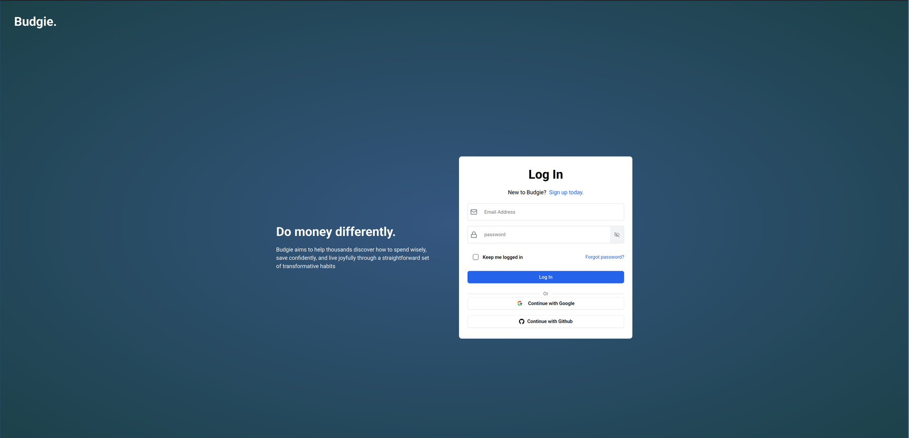
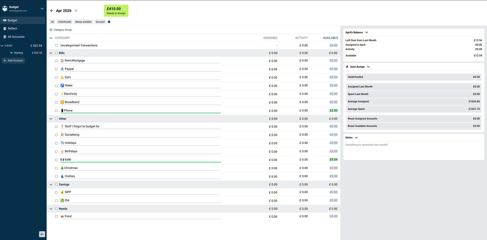
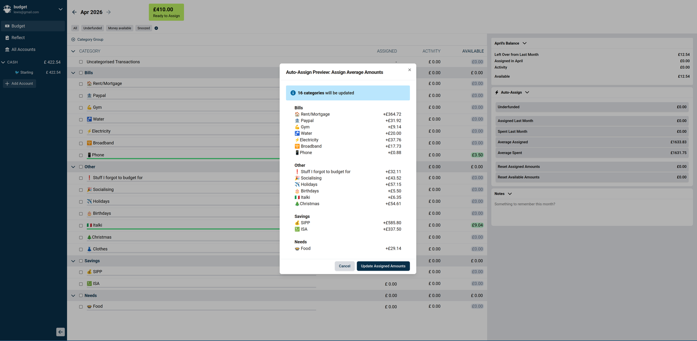

# Budgie 🐦

**⚠️ THIS PROJECT IS CURRENTLY IN ACTIVE DEVELOPMENT**  
**❌ A LIVE WEBSITE IS COMING SOON**

Budgie is a personal finance management tool made to help track and control spending using category allocation and the envelope budgeting method.

It is 100% free and open-source, built with NodeJS, ReactJS and PostgreSQL.

This application allows you to:

- **Allocate funds to categories** and track spending against them
- **Visualise monthly expenditure** with easy-to-read charts
- **Manage multiple accounts** and review all transactions in one place
- **See how your spending aligns with the budget** on a monthly basis

## Tech Stack

| Frontend | State Management          | Backend              | Database                | Styling      |
| -------- | ------------------------- | -------------------- | ----------------------- | ------------ |
| React.js | Redux Toolkit + RTK Query | Express.js / Node.js | PostgreSQL (Prisma ORM) | Tailwind CSS |

---

## Table of Contents

- [Screenshots](#screenshots)
- [Installation (TODO)](#installation)

## Screenshots

  

_Login page._

  

_Allocation landing page._

  

_Auto-assign budget feature._

> _Future screenshots will include: Reflect page and Accounts page_

## Installation (TODO)

Instructions for running the project locally will be added soon.
