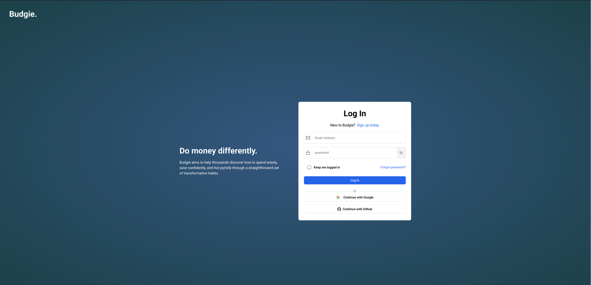
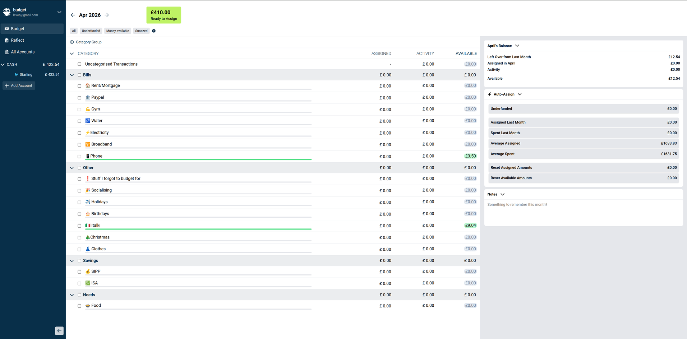
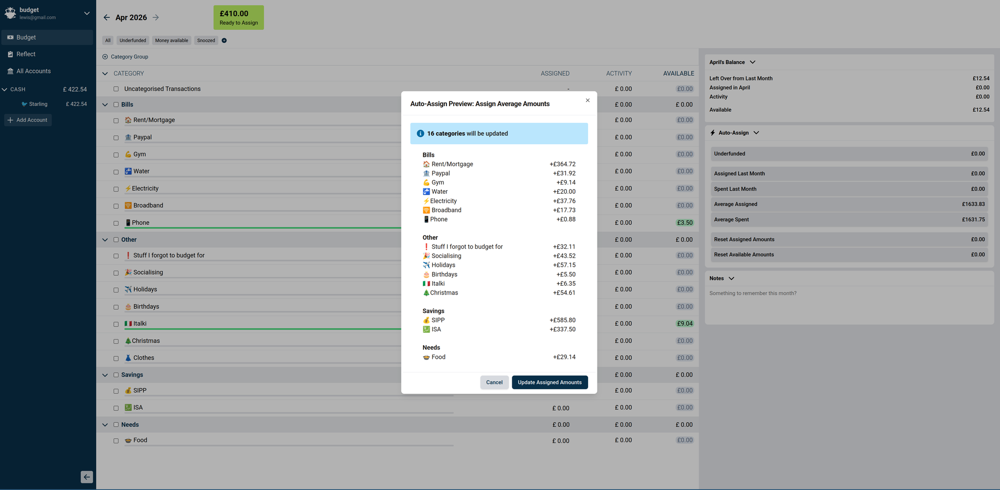

# Budgie 🐦

[](https://github.com/lewisjohnward/budgie/actions/workflows/ci.yml?query=branch%3Amain)

Budgie is a self-hosted personal finance management application based on the envelope budgeting method.

It provides tools for allocating available funds to spending categories, recording and categorising transactions, managing accounts, and reviewing spending against a monthly budget.

Budgie is free and open-source, with Docker Compose used to provide a straightforward self-hosting setup.

## Table of Contents

- [Why Budgie?](#why-budgie)
- [Features](#features)
- [Tech Stack](#tech-stack)
- [Backend](#backend)
- [Frontend](#frontend)
- [Screenshots](#screenshots)
- [Self-hosting](#self-hosting)
- [Development](#development)
- [Live Demo](#live-demo)
- [Deployment](#deployment)

## Why Budgie?

Budgie was built around a simple budgeting workflow:

Record income and available funds.
Allocate those funds across spending categories.
Record transactions as spending occurs.
Monitor category balances throughout the month.
Adjust allocations as circumstances change.

The aim is to make the relationship between available money, planned spending, and actual spending explicit rather than treating budgeting as simply tracking transactions after they occur.

## Features

- Envelope budgeting — allocate available funds across spending categories
- Monthly budgets — manage category allocations and spending on a month-by-month basis
- Transaction management — record, edit, categorise, and review transactions
- Multiple accounts — manage transactions across multiple accounts
- Transfers — transfer funds between accounts while maintaining account balances
- Auto-assign — automatically allocate available funds according to budget rules
- Category management — create, rename, reorder, and organise categories
- Monthly memos — attach notes to budget months
- Authentication — user accounts with authenticated sessions

## Tech Stack

| Frontend | State Management          | Backend              | Database                | Styling      |
| -------- | ------------------------- | -------------------- | ----------------------- | ------------ |
| React.js | Redux Toolkit + RTK Query | Express.js / Node.js | PostgreSQL (Prisma ORM) | Tailwind CSS |

## Backend

The backend follows a layered structure:

HTTP Request  
↓  
Controller  
↓  
Use Case  
↓  
Service  
↓  
Repository  
↓  
Prisma / PostgreSQL

Features are organised by domain rather than by technical layer alone. Shared infrastructure such as authentication, database access, middleware, and validation is kept separate from feature-specific code.

The API is documented using OpenAPI.

## Frontend

The frontend is built around React and Redux Toolkit. RTK Query is used for API communication and server state, while React Hook Form and Zod are used for form handling and validation.

The frontend is served as a static application and communicates with the backend API through the same deployment environment.

---

## Screenshots

<p align="center">
  
</p>
_Login page._

<p align="center">
  
</p>
_Allocation landing page._

<p align="center">
  
</p>
_Auto-assign budget feature._

## Self-hosting

#### Requirements

- Docker
- Docker Compose

Clone the repository and run the setup script:

```bash
git clone https://github.com/lewisjohnward/budgie.git
cd budgie
./setup.sh
docker compose up -d
```

Once the containers are running, Budgie will be available at http://localhost.

To stop the application:

```bash
docker compose down
```

To stop the application and remove all Docker volumes, including the PostgreSQL database:

```bash
docker compose down -v
```

> [!CAUTION]
> Removing the volumes permanently deletes all data stored by Budgie.

#### Configuration

The setup script provides sensible defaults for local use. Configuration can be adjusted in .env before starting the application.

The HTTP and HTTPS ports can be changed if ports 80 or 443 are already in use on the host.

## Development

#### Requirements

- Node.js
- npm
- Docker

Clone the repository:

```bash
git clone https://github.com/lewisjohnward/budgie.git
cd budgie
./setup-dev.sh
nvm use
```

The frontend and backend are run as separate development processes and should be started in separate terminals.

Start the database:

```bash
cd backend
make run-db
make setup-db
```

Install frontend dependencies:

```bash
cd frontend
npm install
```

Install backend dependencies:

```bash
cd backend
npm install
```

Start the backend:

```bash
cd backend
npm run dev
```

Start the frontend:

```bash
cd frontend
npm run dev
```

## Live Demo

A disposable public demo is available at:

https://trybudgie.co.uk

The demo environment is intended for exploring the application and is resettable. Data should not be considered persistent.

For persistent use, Budgie can be self-hosted using Docker Compose.

## Deployment

Budgie is deployed using GitHub Actions.

- Backend, frontend and end-to-end tests run in CI
- Demo and production Docker images are built in GitHub Actions
- Images are published to GitHub Container Registry
- The demo runs on a Linode instance using Docker Compose
- Caddy provides HTTPS with automatic Let's Encrypt certificates
